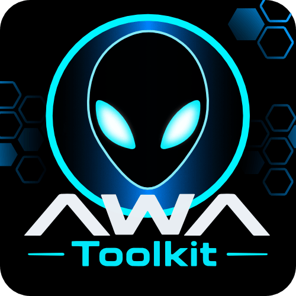
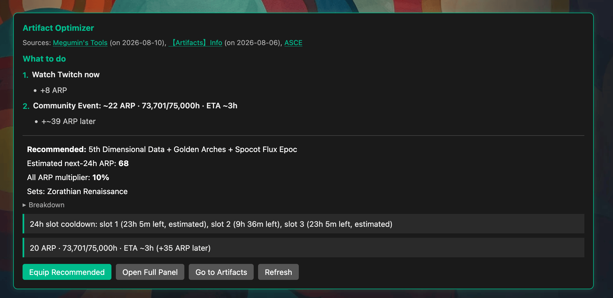

# AWA Toolkit

Recommendations and filters for [Alienware Arena](https://www.alienwarearena.com/) — loadouts, ARP tasks, giveaways, and UCF reading.

* **Artifact Optimizer** — best loadout for the next 24h, Control Center task list, META upgrade path
* **Filters** — hide or dim giveaways and Game Vault items (higher tier, claimed, out of stock)
* **UCF** — reading mode and classic tables on forum threads

## Install

[Install](https://raw.githubusercontent.com/UpDownLeftDie/AWA-Toolkit/main/dist/awa-toolkit.user.js)

Needs a userscript manager ([Violentmonkey](https://violentmonkey.github.io/) recommended). Best in [Zen](https://zen-browser.app/) or [Firefox](https://www.firefox.com).

Open the user menu gear → **Artifact Optimizer** or **Filter Settings**. On Control Center, an injected panel shows a prioritized **What to do** list.

## Artifact Optimizer

Reads your Showroom, Control Center, Battle Pass, Game Vault, ARP Log, and (when live) Steam Community Event. Panels paint from cache first, then refresh in the background when stale (~6h).

**Loadouts** — Scores 3-artifact combos for the next 24h lock window (remaining today, next UTC dailies if capped, Monday Steam Quests when that reset falls inside the lock). Category bonuses first, then All-ARP% (H\`erkow Plasma Chamber / Zorathian). Also surfaces market-discount sets when a vault buy would be blocked by a lock, and Megumin’s standing monthly META set on the Showroom.

**Tasks** — Control Center lists what to do next from activity caps, Steam Quests, Twitch, Discord poll, Battle Pass ready rewards, and community-event ARP still wearing under the lock. Community hours / unlock ETA come from [ASCE](https://github.com/MarvashMagalli/ASCE); already-granted event rewards are checked against the ARP Log.

**Upgrades** — Long-term META path (HPC → Pn295 Twitch → Chai → …) using tiers you own. Plan only — leftover shards are not pushed onto cheaper sidegrades.

**Notifications** (optional) — Desktop pings when a recommended swap’s lock ends, community hours unlock, Game Vault opens or adds games, or a new official key giveaway posts. An AWA tab must stay open to schedule them.

## UCF Posts

Sticky bar on `/ucf/show/...`:

* **Reading mode** — full-width thread (hides board sidebar and author columns)
* **Classic tables** — bordered tables (on by default)
* **Top / Bottom** — jump within the original post

Choices are remembered across posts.

## Limitations

* Slot cooldowns are inferred from Showroom lock icons and a local log — the server does not expose them.
* Notifications only schedule while an AWA tab is open.
* Some activity signals are best-effort (“still available” when markup differs).
* Steam Quests / Community Events need the game owned on the linked Steam account (not family sharing). Paid games are skipped; free / $0 titles stay listed. **Check Game** / **Visit Steam** / **Sync Games** means ownership has not shown up yet.
* Battle Pass ready-to-claim counts are informational; season thresholds are not hardcoded.

## Credits

ARP math and META guidance from [Megumin's Tools](https://docs.google.com/spreadsheets/d/1VCzq6Trwc9T_wEsvTANpL7yy8FaJ6psSsKYn4O4riw8/edit?usp=sharing) ([Upgrade C/P](https://docs.google.com/spreadsheets/d/1VCzq6Trwc9T_wEsvTANpL7yy8FaJ6psSsKYn4O4riw8/edit?gid=1046753957#gid=1046753957), [ARP Calculator](https://docs.google.com/spreadsheets/d/1VCzq6Trwc9T_wEsvTANpL7yy8FaJ6psSsKYn4O4riw8/edit?gid=1289162159#gid=1289162159)), the [【Artifacts】Info](https://www.alienwarearena.com/ucf/show/2167784) thread, and Megumin’s AWA Discord guides. Community-event hours from [ASCE](https://github.com/MarvashMagalli/ASCE).
